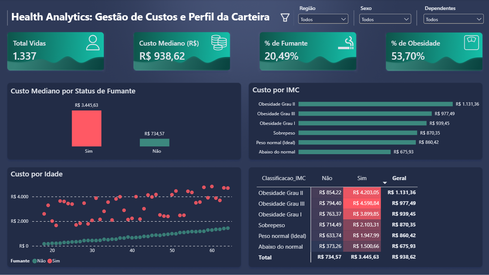

# Simulador de Custos Médicos – Análise de Sinistralidade em Planos de Saúde

**Autor:** Adriano Parente Machado <br>
**Área:** Análise de Dados e Business Intelligence

🔗 [Acesse a aplicação online](https://simulador-custos-medicos.streamlit.app)

---

## Sobre o projeto

Este projeto analisa os principais fatores que impulsionam os custos de um plano de saúde corporativo e transforma essa análise em ferramentas úteis para RH e gestão de orçamento: um modelo preditivo de custos, um simulador web e um painel executivo no Power BI.

O trabalho passou por três etapas:

1. **Análise exploratória em Python** — entender o comportamento dos dados e identificar os principais direcionadores de custo.
2. **Painel no Power BI** — visualização executiva dos indicadores da carteira.
3. **Modelo preditivo + aplicação web** — um modelo de machine learning integrado a um app em Streamlit, para simular o custo de um novo colaborador com base no seu perfil.

## Os dados

- **Fonte:** base disponibilizada pela plataforma educacional Preditiva, usada aqui para fins de estudo e portfólio.
- **Volume:** 1.337 registros de colaboradores.
- **Qualidade:** sem valores ausentes; um registro duplicado foi encontrado e removido na limpeza.
- **Variáveis:** idade, sexo, IMC, número de filhos, status de tabagismo, região e custo de saúde (variável-alvo).

## Principais achados

- **A média engana.** O gasto médio (R$ 1.327) é puxado para cima por casos extremos de sinistralidade. A mediana (R$ 938) representa melhor o comportamento típico da carteira, e foi a métrica adotada para decisões de negócio.
- **Tabagismo é o fator que mais pesa.** Sozinho, já é o maior direcionador de custo. Combinado com obesidade, o custo mediano chega a quadruplicar em relação a um perfil não fumante e com peso normal.
- **Região, gênero e número de dependentes** têm correlação baixa com os picos de custo — não são bons preditores isoladamente.

## Stack utilizada

- **Python:** Pandas, Scikit-Learn e Joblib para construir e salvar o modelo preditivo.
- **Streamlit:** interface web e deploy em nuvem (Streamlit Community Cloud).
- **Power BI + DAX:** camada de visualização e cálculo de KPIs.
- **UI:** tema escuro personalizado (paleta teal & beige).

## Modelo Preditivo

Foi utilizada uma **Regressão Linear**, treinada com 80% da base e validada nos 20% restantes.

| Métrica | Valor |
|---|---|
| R² (poder de explicação) | 0.80 |
| MAE (erro médio absoluto) | R$ 433,11 |
| RMSE (raiz do erro quadrático médio) | R$ 603,08 |

O modelo explica cerca de 80% da variação nos custos de saúde, com um erro médio de aproximadamente R$ 433 por colaborador — um resultado sólido considerando a simplicidade do modelo.

**Variáveis com maior peso no custo (coeficientes):**
- Ser fumante: +R$ 2.303,93
- Obesidade Grau II: +R$ 826,16
- Obesidade Grau III: +R$ 768,55
- Obesidade Grau I: +R$ 689,75

Esses coeficientes confirmam o que a análise exploratória já indicava: tabagismo e obesidade são, de longe, os maiores direcionadores de custo.

## Aplicação web

O simulador permite que gestores de RH estimem o impacto financeiro mensal de um novo colaborador a partir do seu perfil demográfico e clínico.

👉 [simulador-custos-medicos.streamlit.app](https://simulador-custos-medicos.streamlit.app)

**Estrutura do repositório:**
```
Power BI/           → relatório executivo (.pbix)
dados/              → bases usadas nas análises
models/             → modelo treinado (modelo_predicao_custos.pkl)
notebooks/          → análise exploratória e treinamento do modelo
app.py              → código principal da aplicação web
requirements.txt    → bibliotecas utilizadas na aplicação
```

## Dashboard (Power BI)


O painel foi organizado em quatro blocos:

1. **Filtros de contexto** — segmentação por região, sexo e dependentes.
2. **KPIs principais** — volume de vidas, custo mediano, % fumantes, % obesidade.
3. **Análise causal** — gráficos mostrando o impacto do tabagismo e a progressão de custo por faixa de IMC.
4. **Mapa de risco combinado** — heatmap cruzando tabagismo x IMC, destacando os grupos de maior custo.
